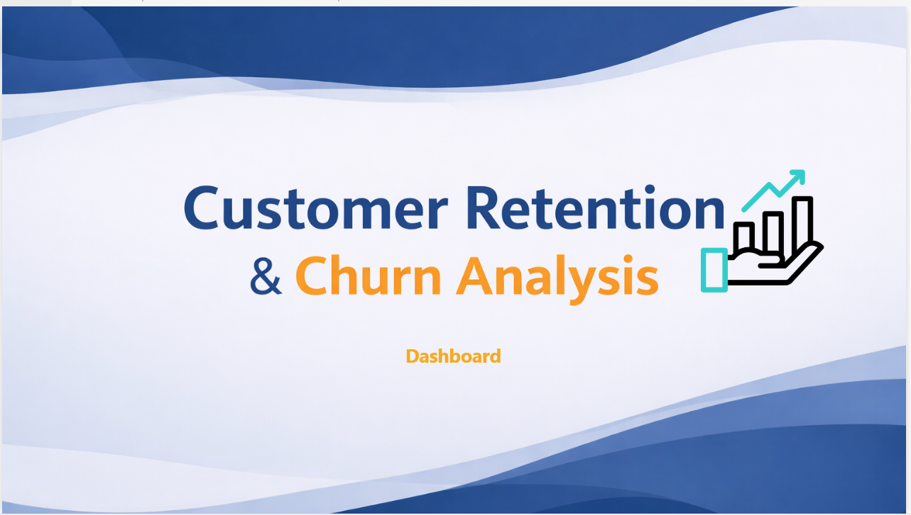
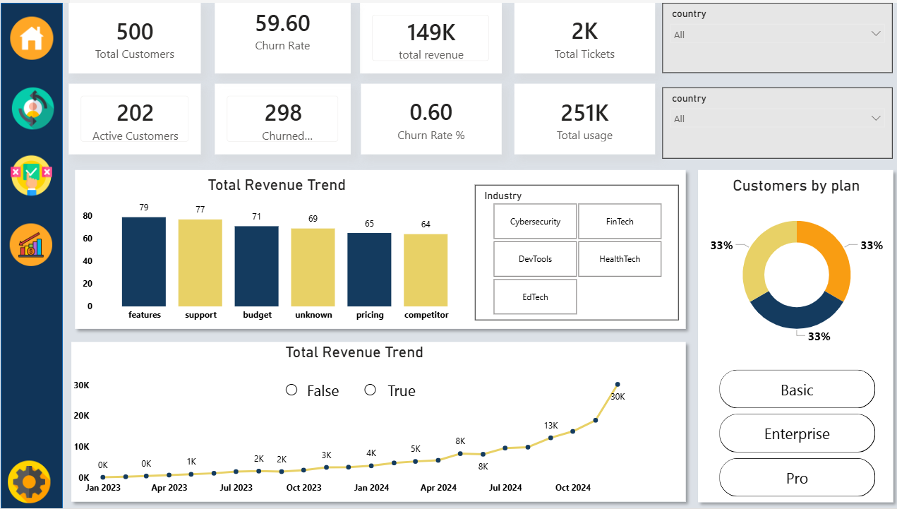
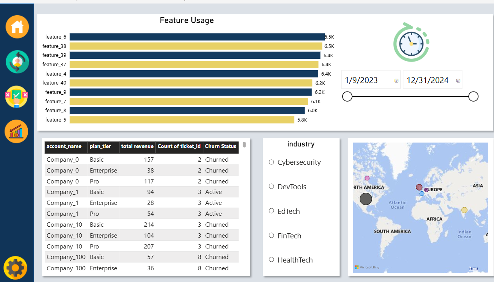
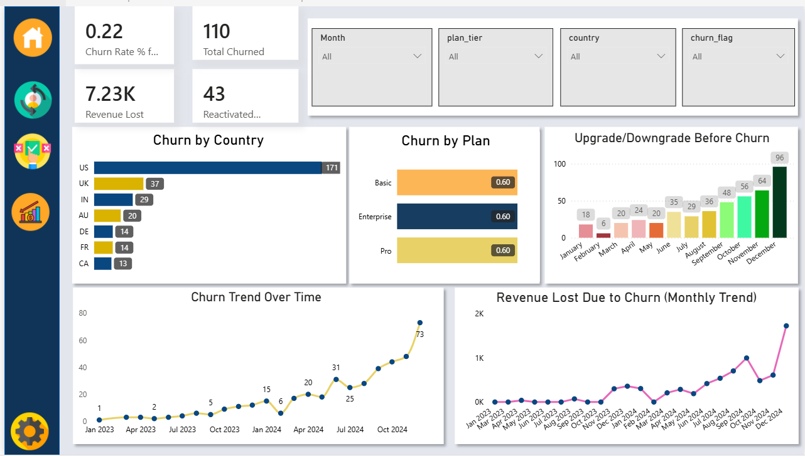

# -FUTURE_DS_02
# 📊 Customer Retention & Churn Analysis Dashboard

## 📌 Overview
This project is a Power BI dashboard designed to analyze customer churn, retention behavior, and revenue impact for a SaaS subscription-based business.

The dashboard provides actionable insights into churn trends, financial loss, customer risk segmentation, and reactivation performance.

---

## 🗂 Data Sources
The analysis was built using the following datasets:

- ravenstack_accounts.csv
- ravenstack_subscriptions.csv
- ravenstack_feature_usage.csv
- ravenstack_churn_events.csv
- ravenstack_support_tickets.csv

A star schema data model was implemented with proper one-to-many relationships.

---

## 📐 Key Features

### 🔹 KPI Metrics
- Total Customers Churned
- Churn Rate %
- Revenue Lost Due to Churn
- Reactivated Customers

### 🔹 Churn Analytics
- Monthly Churn Trend
- Revenue Loss Trend
- Churn by Plan Tier
- Churn by Country
- Support Tickets vs Revenue (Risk Identification)

### 🔹 Behavioral Insights
- Feature Usage Analysis
- Usage vs Churn Comparison
- Customer Drill-Down Table

---

## 🧮 DAX Measures Implemented
- Total Churned
- Churn Rate %
- Revenue Lost
- Reactivated Customers
- Ticket Count
- Monthly Aggregations using YearMonth sorting logic

---

## 📊 Business Value

This dashboard enables:
- Identification of high-risk customer segments
- Revenue impact analysis due to churn
- Trend monitoring over time
- Customer support risk analysis
- Data-driven retention strategy planning

---

## 🛠 Tools Used
- Power BI Desktop
- DAX (Data Analysis Expressions)
- Data Modeling (Star Schema)
- Data Visualization Best Practices

---

## 📷 Images

---

## 👩‍💻 Author
Lavanya Rayudu
